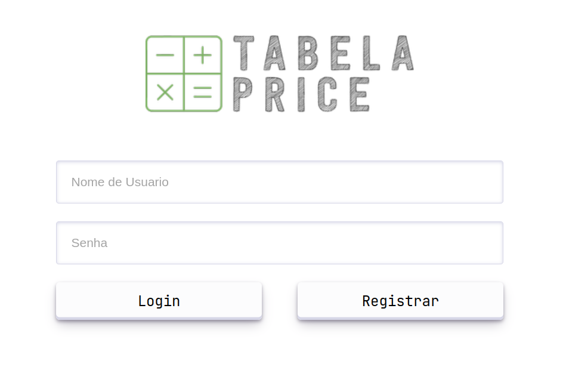
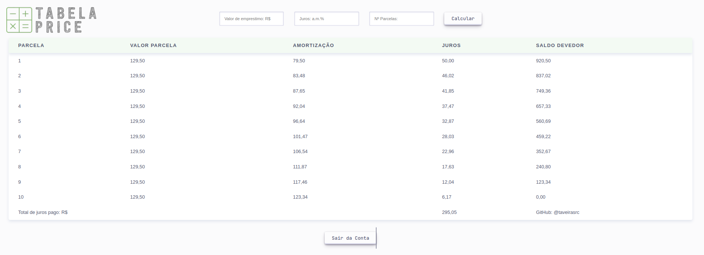

# GoPRICE - WEB TABELA PRICE :heavy_minus_sign: :heavy_plus_sign: :heavy_multiplication_x: :heavy_division_sign:  

> Web Tabela Price, é uma calculadora do sistema francês de amortização, efetua o cálculo de empréstimos iguais acrescidos de juros, com base no sistema de juros compostos. Backend em Java com Servlets, JSP (será alterado para JSON e API), JSTL e servidor Apache Tomcat.

###### [Tabela Price](https://pt.wikipedia.org/wiki/Tabela_Price) | [Amortization schedule](https://en.wikipedia.org/wiki/Amortization_schedule)

### [Acesse aqui a aplicação](https://pricefipp.jvmhost.net/)
_Apenas navegador web desktop :hourglass_flowing_sand:_

#### :warning: Atenção :warning:

###### O sistema está hospedado em um hosting especializado em hospedagem de tecnologias Java, somente para apresentação, os dados de login são armazenados em tempo de execução, ainda sem banco de dados, por tanto, não registre dados reais, somente dados fictícios para teste.

 

## Instruções de uso

  

    
<em>Formulário de Registro e Login</em>

    
  

### Para registrar:

No campo `Nome de Usuário` o login deve conter de 6 a 8 caracteres, e não pode estar registrado. No campo de `Senha`, o servidor espera uma string de apenas 4 dígitos contendo pelo menos 1 número e letras, ou pelo menos 1 letra e números.

### Para logar:

O `Nome de Usuário` deve existir, no "banco", e a senha deve tem que coincidir com o registro.

 
⚙️ Confira a sequência lógica:

 

- Nome de usuário já existe.
    - ❌ Alert: *“Nome de usuário já existe”.*
- Nome de usuário não existe.
    - Quantidade de caracteres menor que 6 e maior que 8 *(Nome de usuário)*.
        - ❌ Alert: *“Nome de usuário deve ter o tamanho de 6 a 8 caracteres”.*
    - Quantidade de caracteres valida *(Nome de usuário)*.
        - Senha menor ou maior que 4 dígitos.
            - ❌ Alert: *“A senha deve conter 4 dígitos”*.
        - Senha com exatamente 4 dígitos.
            - Senha contem caracteres não alfanuméricos.
                - ❌ Alert: *“Apenas caracteres alfanuméricos”.*
            - Senha apenas com caracteres alfanuméricos.
                - Senha sem números.
                    - ❌ Alert: *“A senha deve conter pelo menos um número”.*
                - Senha com números.
                    - Senha sem letras.
                        - ❌ Alert: *“A senha deve conter pelo menos uma letra”.*
                    - Senha com letras.
                        - ✅ Alert: *“Registro efetuado com sucesso efetue o login”.*

  

  

    
<em>Tabela de Parcelas (Após autenticado)</em>

    
  

### Realizando o cálculo & gerando a tabela:

Hà três campos para serem preenchidos.

- `Valor do Empréstimo` valor do montante a ser feito o empréstimo, exe.: `10000.00`.

- `Taxa de Juros a.m.%` valor percentual de `0.0%` a `100.0%`, que será a taxa que inside sobre as parcelas, exe.: `2.5`.

- `Nº Parcelas` quantidade de parcelas, exe.: `8`.

Clicando em `Calcular` a tabela é gerada.

  

## Contribua
 
- [x] Beta front-end
- [x] Cálculo parcelas
- [ ] Definição de padrão de projeto
- [ ] Inclusão de API
- [ ] Responsividade (Suporte mobile)
- [ ] Adaptatividade
- [ ] Banco de Dados Relacional
- [ ] Resposta em JSON
- [ ] ...

## Licença

[MIT License](./LICENSE)
